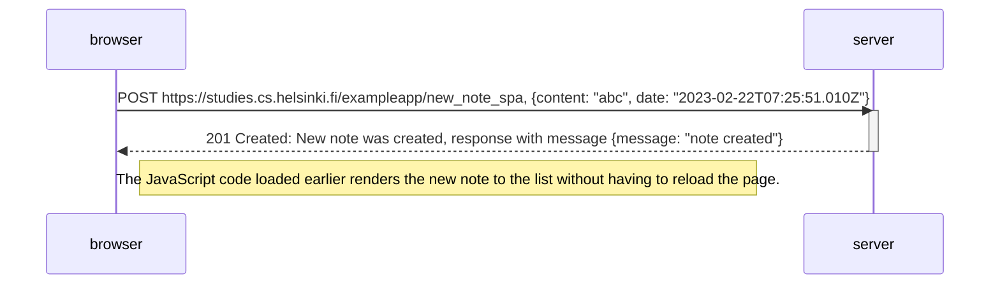

# 0.6: Uusi muistiinpano

```mermaid
sequenceDiagram
    participant browser
    participant server

    browser->>server: POST https://studies.cs.helsinki.fi/exampleapp/new_note_spa, {content: "abc", date: "2023-02-22T07:25:51.010Z"}
    activate server
    server-->>browser: 201 Created: New note was created, response with message {message: "note created"}
    deactivate server

    Note right of browser: The JavaScript code loaded earlier renders the new note to the list without having to reload the page.
```